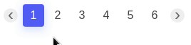

## Features & characteristics:
* No dependencies
* Very lean and simple
* Configurable (see props list below)

## Props list
* `:currentPage` used to choose a current dynamic page.
* `:totalPages` set the total number of pages.
* `:maxPagesDisplayed` set the maximum number of pages displayed.

## Events list
* `@changePage` event called when the page changes. Returns the number of the new page.

## Example


## Install & basic usage

```bash
npm install vue-easy-pager
``` 

```vue
<template>
  <div>
    <vue-easy-pager
      :currentPage="1"
      :totalPages="20"
      :maxPagesDisplayeds="6"
    />
  </div>
</template>

<script>
import VueEasyPager from 'vue-easy-pager';
export default {
  components: { VueEasyPager },
}
</script>

```